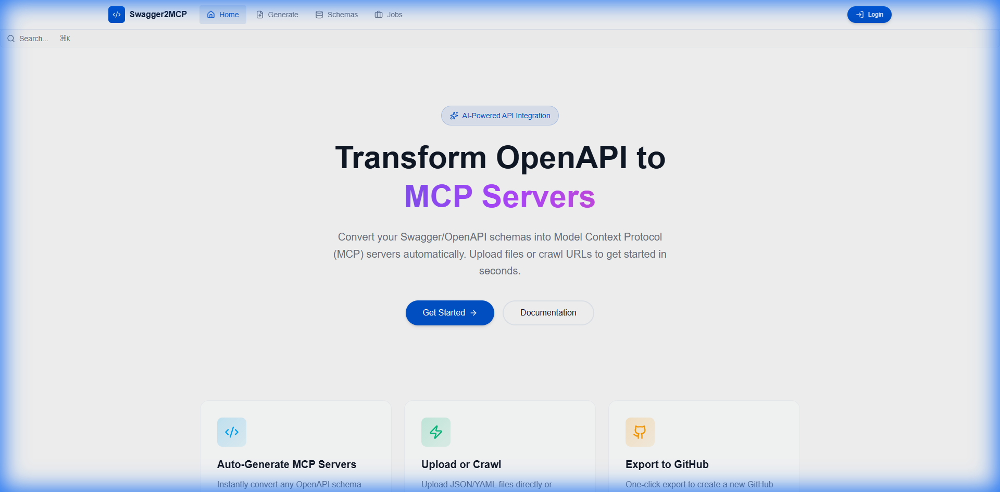
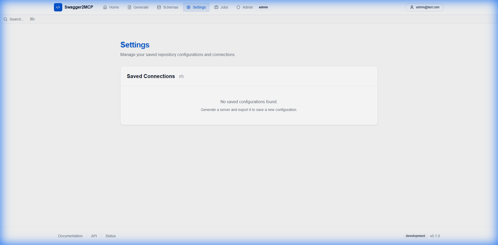
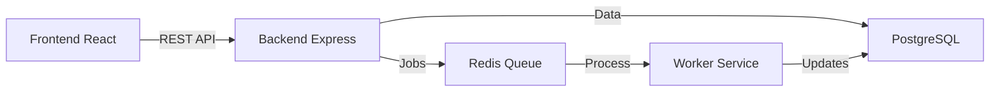

# Swagger2MCP

[](https://github.com/tomer1983/swagger2mcp/actions/workflows/ci.yml)
[](https://opensource.org/licenses/MIT)
[](https://www.typescriptlang.org/)
[](https://www.docker.com/)
[](https://reactjs.org/)
[](http://makeapullrequest.com)

**Transform OpenAPI/Swagger specifications into [Model Context Protocol (MCP)](https://modelcontextprotocol.io/) servers instantly.**

> 🚀 **Swagger2MCP** is a powerful tool ensuring LLMs can securely and accurately interact with your APIs. Upload a schema or crawl a documentation site, and get a fully functional, type-safe MCP server in seconds.



## ✨ Features

- 📤 **Drag & Drop Upload**: Support for OpenAPI v2/v3 JSON/YAML files.
- 🌐 **Intelligent Web Crawling**: Point to any documentation URL and let our crawler discover schemas.
- 🔧 **Automatic Code Generation**: Production-ready TypeScript MCP servers.
- 📦 **One-Click Export**: Push directly to **GitHub** / **GitLab** or download as ZIP.
- 🔐 **Secure Management**: Store API tokens and configurations securely with audit logging.
- 🐳 **Dockerized**: Deploy anywhere with a single `docker-compose up`.
- 📊 **Job Tracking**: Real-time progress monitoring for long-running crawling jobs.

## 🚀 Quick Start

### Prerequisites

- **Docker** & **Docker Compose** installed.
- **Node.js 18+** (only if running locally without Docker).

### Running with Docker (Recommended)

```bash
# Clone the repository
git clone https://github.com/tomer1983/swagger2mcp.git
cd swagger2mcp

# Start the application
docker-compose up
```

Visit the application at **[http://localhost:5173](http://localhost:5173)**.

## 📸 Screenshots

| Dashboard | Settings & configuration |
|:---:|:---:|
|  |  |

## 📚 Documentation

- [**Development Guide**](./docs/DEVELOPMENT.md) - Setup for contributors.
- [**API Documentation**](./docs/API-DOCUMENTATION.md) - REST API reference.
- [**Kubernetes Deployment**](./docs/kubernetes.md) - Deploy to Kubernetes or use Helm charts.
- [**Authentication**](./docs/AUTHENTICATION.md) - Security details.
- [**Testing Guide**](./docs/MANUAL-TESTING-GUIDE.md) - QA procedures.

## ☸️ Kubernetes Deployment

Deploy swagger2mcp to any Kubernetes cluster:

### Using Manifests
```bash
kubectl apply -f k8s/namespace.yaml
kubectl apply -f k8s/
```

### Using Helm
```bash
helm install swagger2mcp ./charts/swagger2mcp --namespace swagger2mcp --create-namespace
```

See the [full Kubernetes guide](./docs/kubernetes.md) for detailed instructions.

## 🏗️ Architecture

Swagger2MCP is built with a modern tech stack designed for reliability and scalability:



- **Frontend**: React, Vite, TailwindCSS, Shadcn UI
- **Backend**: Node.js, Express, Prisma ORM
- **Infrastructure**: Docker, Nginx (optional), BullMQ (Redis)

## 🤝 Contributing

We welcome contributions! Please see our [Contributing Guidelines](CONTRIBUTING.md) for details.

1. Fork the Project
2. Create your Feature Branch (`git checkout -b feature/AmazingFeature`)
3. Commit your Changes (`git commit -m 'Add some AmazingFeature'`)
4. Push to the Branch (`git push origin feature/AmazingFeature`)
5. Open a Pull Request

## 🔒 Security

For security concerns, please refer to our [Security Policy](SECURITY.md).

## 📜 License

Distributed under the MIT License. See `LICENSE` for more information.

## 💬 Community

- [Submit a Bug Report](.github/ISSUE_TEMPLATE/bug_report.md)
- [Request a Feature](.github/ISSUE_TEMPLATE/feature_request.md)

---
<p align="center">
  Built with ❤️ by the Swagger2MCP Team
</p>
