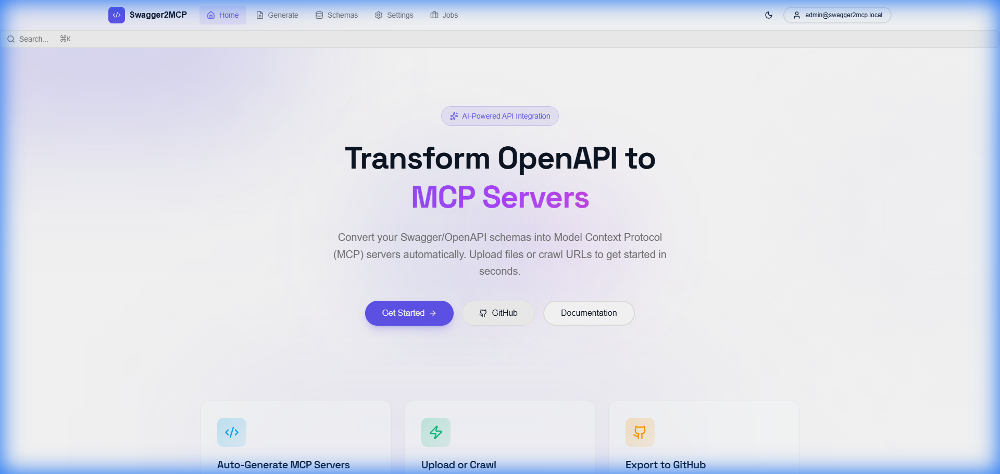
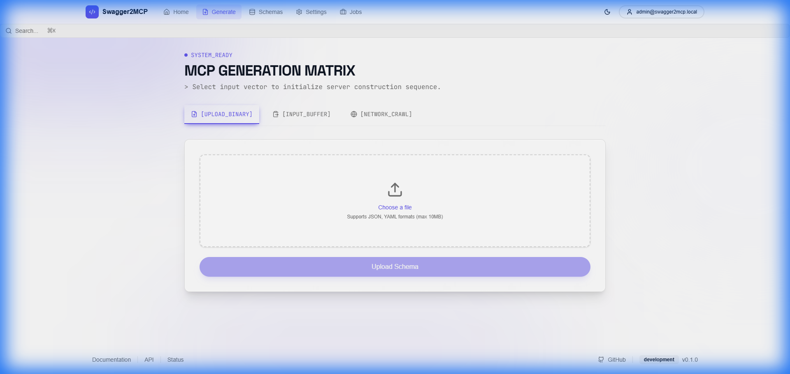
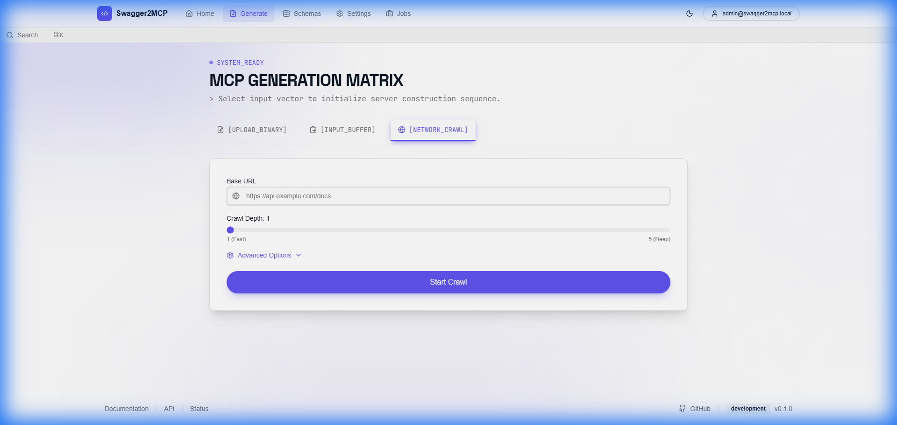
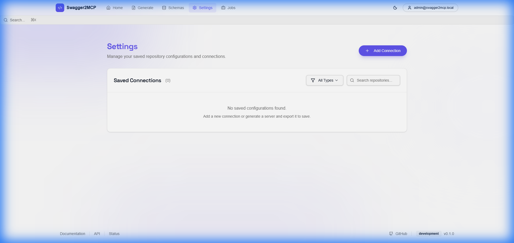

# Welcome to Swagger2MCP

**Transform OpenAPI/Swagger specifications into secure, type-safe Model Context Protocol (MCP) servers instantly.**



## Introduction

As Large Language Models (LLMs) become central to software development, connecting them securely to your existing APIs is critical. **Swagger2MCP** bridges this gap by automatically converting your OpenAPI (Swagger) definitions into fully functional MCP servers.

Instead of manually writing tool definitions or glue code, Swagger2MCP allows you to:
- **Upload** your OpenAPI schema files.
- **Crawl** your documentation sites to discover APIs.
- **Generate** production-ready MCP servers in TypeScript.

This documentation will guide you through installing, configuring, and using Swagger2MCP to supercharge your LLM integrations.

---

## Getting Started

### Prerequisites

Before you begin, ensure you have the following installed:
- **Docker** and **Docker Compose** (Recommended for easiest setup).
- **Node.js 18+** (Only if running locally without Docker).

### Installation and Setup

The fastest way to run Swagger2MCP is using Docker Compose. This spins up all necessary services (Frontend, Backend, Worker, Redis, Postgres) in a single command.

1.  **Clone the Repository**:
    ```bash
    git clone https://github.com/tomer1983/swagger2mcp.git
    cd swagger2mcp
    ```

2.  **Start the Application**:
    ```bash
    docker-compose up -d
    ```
    *Note: The first startup may take a few moments as database migrations run.*

3.  **Access the Dashboard**:
    Open your browser and navigate to **[http://localhost:5173](http://localhost:5173)**.

### Initial Login
On first launch, a default admin account is created for you:
- **Email**: `admin@swagger2mcp.local`
- **Password**: `changeme123`

> [!WARNING]
> Please change this password immediately after logging in for the first time via the **Settings** page.

---

## Configuration Guide

Swagger2MCP is designed to be production-ready out of the box, but highly configurable. Configuration is managed via environment variables in the `docker-compose.yml` or `.env` file.

### Backend Configuration

| Variable | Description | Default |
| :--- | :--- | :--- |
| `PORT` | API Server port | `3000` |
| `DATABASE_URL` | PostgreSQL connection string | `postgresql://postgres...` |
| `REDIS_HOST` | Redis hostname | `redis` |
| `JWT_SECRET` | Secret key for signing tokens | `dev-secret-key...` |
| `ALLOW_ANONYMOUS` | Allow access without login | `true` (Set to `false` for production) |
| `ADMIN_EMAIL` | Default admin email | `admin@swagger2mcp.local` |

### **Best Practices**

1.  **Security First**: In a production environment, always set `ALLOW_ANONYMOUS=false` and provide a strong `JWT_SECRET`.
2.  **Rate Limiting**: The application includes built-in rate limiting. For high-traffic public deployments, consider configuring a reverse proxy like Nginx or Cloudflare in front of the application. See [Rate Limiting Guide](RATE_LIMITING_DDOS.md).
3.  **Persistence**: Ensure your Docker volumes (`postgres_data`) are backed up regularly to prevent data loss.

---

## Features & Capabilities

### 1. Drag & Drop File Upload

Upload your existing OpenAPI v2 or v3 specifications (JSON/YAML) directly.



- **Supported Formats**: `.json`, `.yaml`, `.yml`
- **Validation**: Automatic schema validation ensures your MCP server won't crash due to invalid inputs.
- **Privacy**: Files are processed locally within your container; no data is sent to external cloud services.

### 2. Intelligent Web Crawling

Don't have a file handy? Point Swagger2MCP at your documentation URL. The intelligent crawler explores the site to discover and extract OpenAPI schemas automatically.



- **Depth Control**: Configure crawl depth (1-5 levels) to balance between discovery and speed.
- **Real-time Logs**: Watch the crawler's progress as it traverses links and finds API definitions.

### 3. MCP Server Generation

Once your schema is imported, generating an MCP server is one click away.
- **TypeScript Support**: Generates a complete TypeScript project structure.
- **Download as ZIP**: Get the full source code to run locally.
- **Export to GitHub**: Push the generated server directly to a new GitHub repository to start collaborating instantly.

### 4. Settings & Management

Manage your application settings, saved connections, and user accounts from a central dashboard.



---

## Next Steps

Now that you have your environment set up, explore these advanced topics to get the most out of Swagger2MCP:

- **[Detailed API Documentation](API-DOCUMENTATION.md)**: Integrate Swagger2MCP into your own CI/CD pipelines.
- **[Kubernetes Deployment](kubernetes.md)**: Scale up by deploying to a K8s cluster.
- **[Authentication Guide](AUTHENTICATION.md)**: Learn about RBAC and securing your instance.
- **[Manual Testing Guide](MANUAL-TESTING-GUIDE.md)**: Verify generated servers before deployment.
